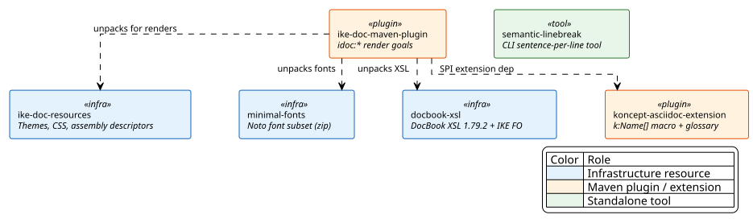
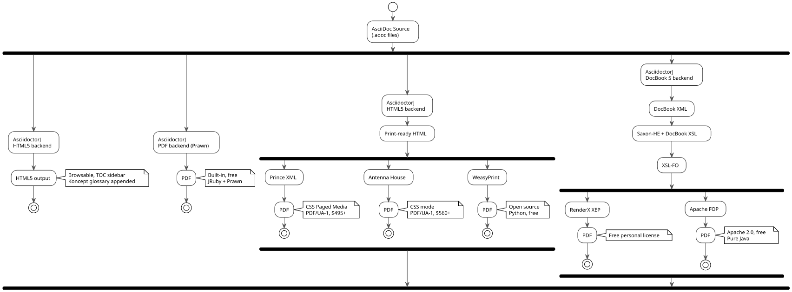

# IKE Documentation Pipeline

[https://central.sonatype.com/artifact/network.ike.docs/ike-docs](https://central.sonatype.com/artifact/network.ike.docs/ike-docs)[1]

`ike-docs` is the documentation-plumbing reactor for the IKE Network. It produces the artifacts that doc-only and hybrid (Java-plus-docs) consumers exercise through `ike-parent` (which lives in `ike-platform`): the `idoc:*` Maven plugin, the Koncept AsciiDoc extension, fonts, DocBook XSL stylesheets, shared rendering resources, and a semantic linebreak reformatter.

Split from the archived `ike-pipeline` monolith in `IKE-Network/ike-issues#216`; custom-packaging machinery further retired in `IKE-Network/ike-issues#321` in favor of a classifier-canonical doc shape.

## [#module-architecture](#module-architecture)Module Architecture

 

`ike-doc-maven-plugin` is the consumer-facing entry point — external doc projects declare it (or rather, declare it indirectly through `ike-parent’s `<pluginManagement>`) and invoke `idoc:*` goals. The other modules are infrastructure artifacts the plugin unpacks at build time, plus a standalone CLI tool.

The reactor itself is not consumed as an aggregator — `ike-parent` lives in `ike-platform`, not here, so external projects do not inherit from `ike-docs/pom.xml`. This reactor exists only to coordinate the build and release cadence of the ike-docs artifacts.

## [#rendering-pipelines](#rendering-pipelines)Rendering Pipelines

All renderers start from the same AsciiDoc source. The pipeline splits into three families based on how intermediate formats reach the final PDF.

 

Render selection is property-driven: every backend is gated by a `-Dike.pdf.<name>=true` toggle. Multiple backends activate concurrently; consumers compare output across renderers without rebuilding.

## [#quick-start](#quick-start)Quick Start

Build the entire reactor with HTML output (default):

```
mvn clean verify
```

Build with the Prawn PDF backend:

```
mvn clean verify -Dike.pdf.prawn
```

Build a single module:

```
mvn clean install -pl ike-doc-maven-plugin -am
```

For consumer-side authoring (a project inheriting `ike-parent` that uses these artifacts), see the [Getting Started](getting-started.html)[2] guide.

## [#module-inventory](#module-inventory)Module Inventory

| Module | Purpose | Packaging |
| --- | --- | --- |
| `ike-doc-resources` | Shared doc-build resources: Asciidoctor themes, FO/CSS print templates, assembly descriptors (including the `adoc.xml` source-classifier descriptor consumed by `ike-parent’s `doc-pipeline` profile), shared docinfo. | `jar` |
| `minimal-fonts` | Noto font subset (NotoSerif, NotoSans, NotoSansMono, math, symbols) packaged as a zip artifact for consistent PDF rendering across machines. | `pom` (zip) |
| `docbook-xsl` | DocBook XSL 1.79.2 stylesheets plus IKE’s FO customization layer. Enables the DocBook → XSL-FO → XEP/FOP rendering family. | `jar` |
| `koncept-asciidoc-extension` | AsciidoctorJ SPI extension providing the `k:Name[]` inline macro for formally identified terminology concepts. Renders SVG badges (HTML/PDF), DocBook phrases (XSL-FO), or plain text (Prawn). Auto-generates a glossary section with definitions, description-logic axioms, SNOMED CT identifiers, and OWL IRIs. | `jar` |
| `ike-doc-maven-plugin` | The `idoc:*` goal prefix — AsciiDoc rendering, multi-renderer PDF wrappers, DocBook XSL patching, breadcrumb injection, renderer log scanning. Regular Maven plugin (no `<extensions>true</extensions>`). [Plugin reference](ike-doc-maven-plugin/index.html)[3]. | `maven-plugin` |
| `semantic-linebreak` | Standalone CLI: reformats AsciiDoc prose to one-sentence-per- line (semantic linefeed). Cleaner git diffs, easier review. | `jar` |

## [#release-position](#release-position)Release Position

```
ike-tooling -> [ike-docs] -> ike-platform -> { doc-example, project-example, integration-tests-example } -> workspace-reactor-example
                                                                                                        -> ike-lab-documents
```

`ike-docs` releases after `ike-tooling` (which provides `ike-maven-plugin` for release orchestration) and before `ike-platform` (which declares `ike-doc-maven-plugin` and the other ike-docs artifacts in `ike-parent’s `<pluginManagement>`/`<dependencyManagement>`).

## [#key-design-decisions](#key-design-decisions)Key Design Decisions

Property-driven renderer toggles Every PDF backend is a thin profile that flips an `ike.skip.*` property from `true` to `false`. Renderers compose: activate several at once with `-Dike.pdf.prawn -Dike.pdf.prince`. The configuration lives in `ike-parent` (in `ike-platform`), which inheriting projects pick up automatically. Artifact-based resource sharing The infrastructure modules (`ike-doc-resources`, `minimal-fonts`, `docbook-xsl`) are packaged as deployable Maven artifacts and unpacked into each consumer’s `target/` at build time. No checked-in copies; everything is regenerated per build. Classifier-canonical doc artifacts Doc payloads ship as `<classifier>adoc</classifier><type>zip</type>` attachments on `<packaging>pom</packaging>` (doc-only) or `<packaging>jar</packaging>` (hybrid) primaries. This replaces the retired `<packaging>ike-doc</packaging>` custom type; see `dev-classifier-canonical-doc-shape` in `ike-lab-documents/topics/` and `IKE-Network/ike-issues#321` for the full design rationale. Koncept markup The `k:ConceptName[]` inline macro renders as an SVG badge linking to an auto-generated glossary section. Definitions are sourced from YAML files and include natural-language definitions, description-logic axioms, SNOMED CT identifiers, and OWL IRIs. Semantic linebreaks The `semantic-linebreak` tool reformats AsciiDoc prose to one-sentence-per-line. This produces cleaner `git diff` output and makes sentence-level review practical.  

## [#the-ike-foundation](#the-ike-foundation)The IKE foundation

`ike-docs` is one of four foundation projects published to Maven Central. Together they form the parent-inheritance forest that every IKE project builds on:

- [ike-base-parent](https://ike.network/ike-base-parent/)[4] — Tier 0 foundation parent POM; shared publishing metadata and signing config.
- [ike-tooling](https://ike.network/ike-tooling/)[5] — Maven plugins for release orchestration and workspace management.
- [ike-docs](https://ike.network/ike-docs/)[6] — the AsciiDoc documentation pipeline and `idoc:*` plugin.
- [ike-platform](https://ike.network/ike-platform/)[7] — the consumer-facing `ike-parent`, the BOM, and the `ws:*` plugin.

## [#resources](#resources)Resources

| Resource | URL |
| --- | --- |
| GitHub | [https://github.com/IKE-Network/ike-docs](https://github.com/IKE-Network/ike-docs)[8] |
| Issues | [https://github.com/IKE-Network/ike-issues](https://github.com/IKE-Network/ike-issues)[9] |
| Nexus Artifacts | [https://nexus.tinkar.org](https://nexus.tinkar.org)[10] |
| IKE Network | [https://ike.network](https://ike.network)[11] |

## [#license](#license)License

Copyright 2025 IKE Network. Licensed under the Apache License, Version 2.0.
